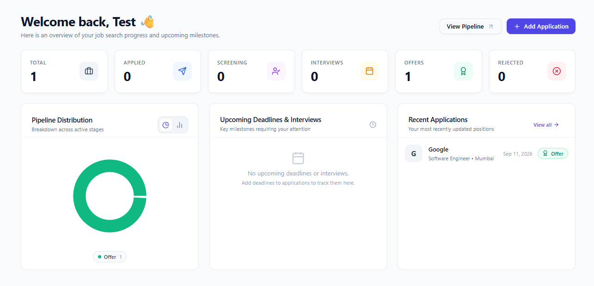
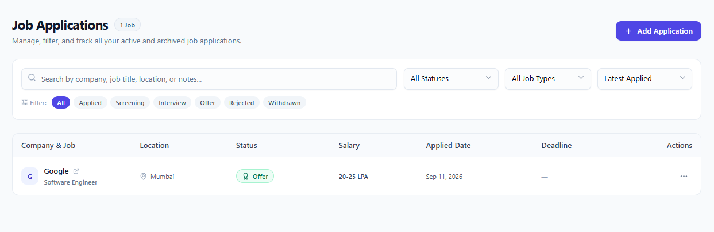
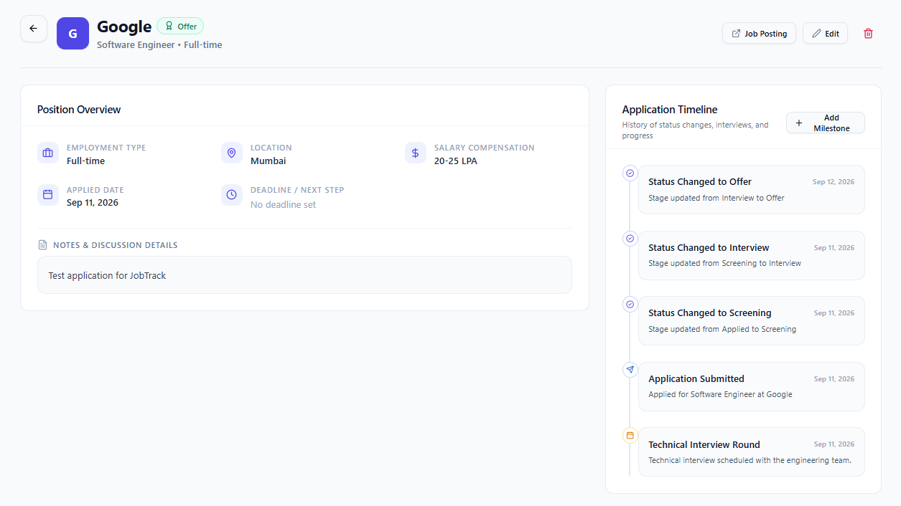
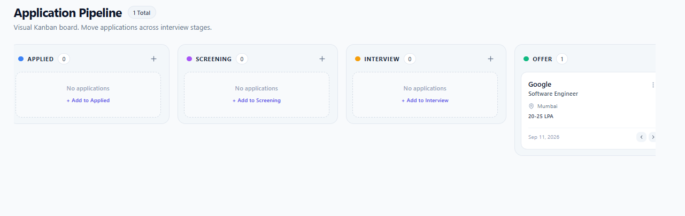
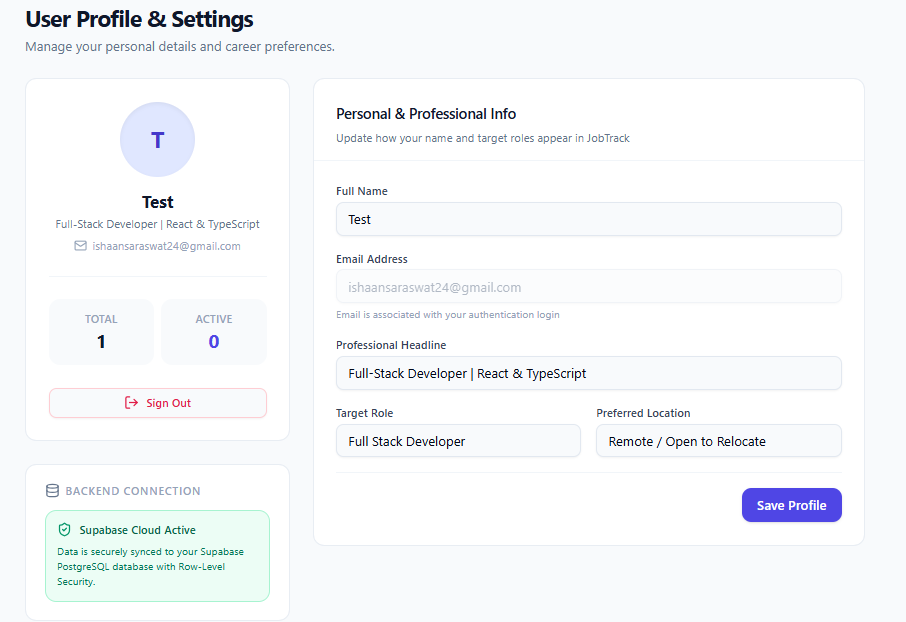

# JobTrack — Job Application Management Platform

A full-stack SaaS-style web application for managing job applications, tracking hiring stages, maintaining application timelines, and visualizing the job search pipeline.

## 🚀 Live Demo

**Live Application:** https://jobtrack-red-ten.vercel.app/

## ✨ Features

- 🔐 Supabase Authentication
  - Email/password sign up and login
  - Protected routes
  - Session persistence

- 📊 Job Search Dashboard
  - Total applications
  - Applied, Screening, Interview, Offer and Rejected statistics
  - Pipeline distribution chart
  - Recent applications
  - Upcoming deadlines and interviews

- 💼 Application Management
  - Add job applications
  - Edit application details
  - Delete applications
  - Track company, role, location and compensation
  - Application date and deadline tracking
  - Notes and next steps

- 🔄 Application Pipeline
  - Kanban-style hiring pipeline
  - Applied
  - Screening
  - Interview
  - Offer
  - Rejected
  - Withdrawn
  - Move applications between stages

- 🕒 Application Timeline
  - Application submission history
  - Status change tracking
  - Interview and milestone events
  - Add custom milestones

- 👤 Profile & Career Preferences
  - Personal information
  - Professional headline
  - Target role
  - Preferred location

- 🔎 Search & Filtering
  - Search by company, job title, location or notes
  - Filter by status
  - Filter by job type
  - Sort applications

- 📱 Responsive SaaS UI
  - Clean dashboard
  - Responsive layouts
  - Loading and empty states
  - User-friendly notifications

## 🛠️ Tech Stack

### Frontend

- React
- TypeScript
- Vite
- Tailwind CSS
- shadcn/ui
- React Router

### Backend & Database

- Supabase
- PostgreSQL
- Supabase Auth
- Row Level Security (RLS)

### Data & Visualization

- TanStack React Query
- Recharts

### Deployment

- Vercel

## 🔄 Application Workflow

```text
Sign Up / Login
       ↓
Dashboard
       ↓
Add Job Application
       ↓
Track Application Status
       ↓
Update Hiring Stage
       ↓
Pipeline & Timeline
       ↓
Dashboard Analytics
```
## 📸 Screenshots

### Dashboard


### Applications


### Application Details


### Application Pipeline


### Profile

